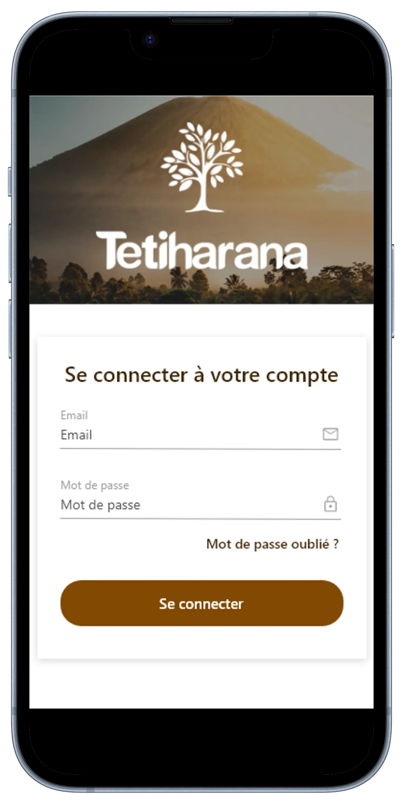
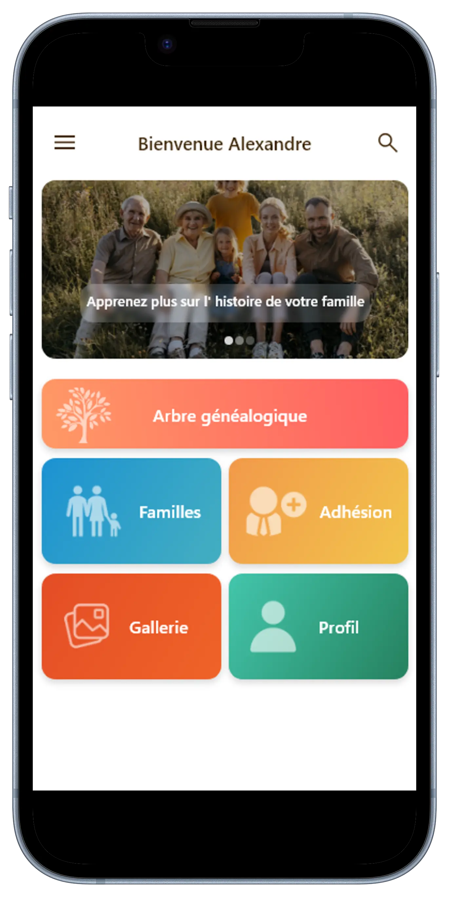
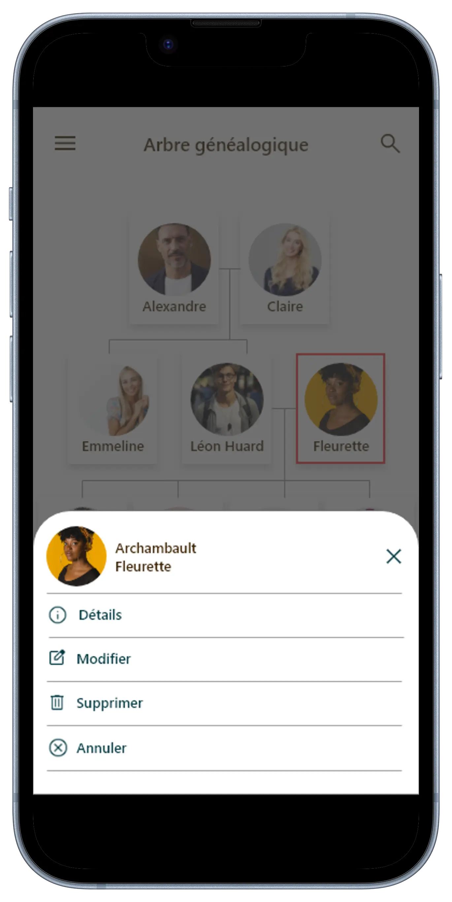

# Tetiharana

"Tetiharana", une application destinnée à tout utilisateur. Ce dernier permet de gérer, modifier, consulter, ou même supprimer une ou plusieurs données de famille. Le but est de renforcer les liens familiales à travers des archives numérisées.

<p align="center">
  
  
  
  
</p>

## Configuration & Installation

``` sh
# Clone with SSH
git clone git@github.com:DTC-Formation/personal-project-Rojotiana-Tsiverisoa.git

# Clone with HTTPS 
git clone https://github.com/DTC-Formation/personal-project-Rojotiana-Tsiverisoa.git

# Installation
flutter pub get
```

## Technologie
- Flutter

## Développeur
- Rojotiana RAKOTOVOLOLONA - [Rojotiana RAKOTOVOLOLONA](https://rojotiana-rakotovololona.com/)